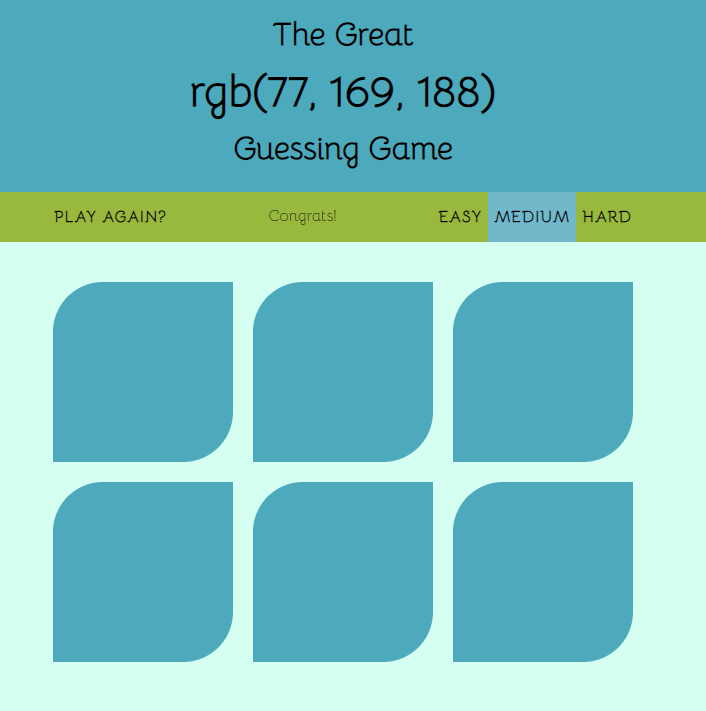
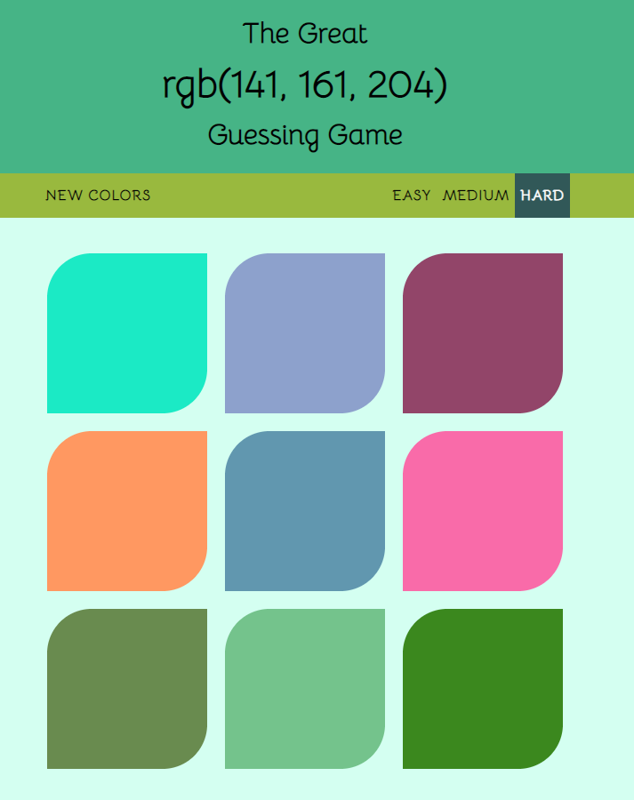

# Color-Game

* Is a small interactive game in which the player is presented with a percentage combination of colors in RGB components and based on that the player tries to guess the correct color. Basically, You can think it like mixing of three different colors red,Green and blue after which You will get another color.

🚀 Starting 
* Runs the html file in any browser.
* The page will reload if you make edits.

Screenshots of a working project
<h1 align="center"> </h1>

🌱 Folder Structure
* colorGame.css (CSS for colorGame)
* colorGame.html (HTML for the game)
* colorGame.js (All the interaction of the user is captured here)

🛠️ Builded with 
* Awesome simple game project writeen purely in HTML, CSS and JavaScript.
